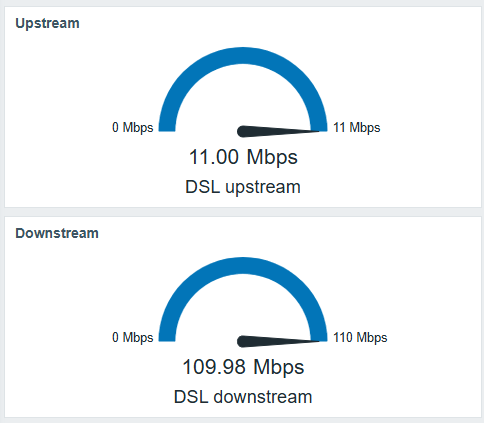
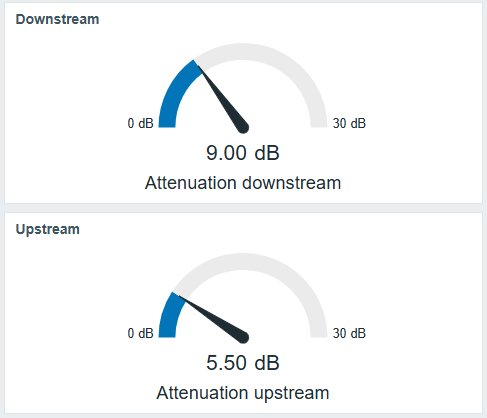
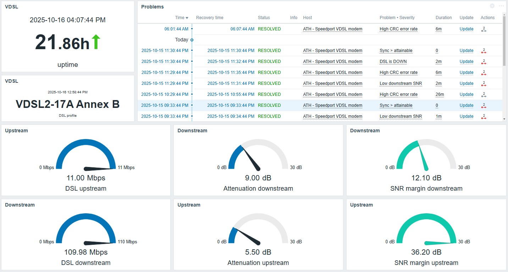

# Zabbix-Speedport-Plus-VDSL
Zabbix template for Speedport Plus VDSL modem

Monitor a Speedport Plus VDSL modem by polling its built-in JSON endpoint and extracting key line stats, health, and firmware info.
Designed and tested for Zabbix 7.0 (probably works on 6.4+)

# What this template does

Uses a single HTTP agent master item to fetch http://modem-ip/data/Status.json.

Parses  and processes JSON attributes into dependent items (no extra polling load).

Provides triggers for link down, resync, SNR margins, CRC error rate, sync vs attainable, and firmware change.

Includes tuning macros so you can adjust thresholds without editing items.

# Prerequisites

Sercomm SpeedPort Plus VDSL modem from Cosmote or any other ISP
Your Zabbix Server/Proxy must be able to reach the modem’s web UI.

# Template macros

| Macro                      |                               Default | Purpose                                                         |
| -------------------------- | ------------------------------------: | --------------------------------------------------------------- |
| `{$MODEM.URL}`             | `http://192.168.0.1/data/Status.json` | JSON endpoint                                                   |
| `{$SNR.DOWN.MIN}`          |                                   `6` | Warn threshold for downstream SNR (dB)                          |
| `{$SNR.UP.MIN}`            |                                   `6` | Warn threshold for upstream SNR (dB)                            |
| `{$ATTAIN.MARGIN}`         |                                `1.05` | Tolerance for sync > max attainable                             |
| `{$CRC.RATE.WARN}`         |                                 `360` | CRC/h **Warning** threshold                                     |
| `{$CRC.RATE.CRIT}`         |                                `1800` | CRC/h **Critical** threshold                                    |
| `{$CRC.RATE.WARN.RECOVER}` |                                 `240` | Warning recovery                                                |
| `{$CRC.RATE.CRIT.RECOVER}` |                                `1200` | Critical recovery                                               |

# Items
Master
- modem.status.json -> HTTP agent; raw JSON (text)

Status / Times
- modem.dsl.status -> DSL state (“online”) (text; heartbeat 1h)
- modem.dsl.online.string -> last DSL online time as string (text; heartbeat 1d)
- modem.router.uptime.string -> router uptime as string

Rates (Mbps)
- modem.dsl.down -> downstream sync
- modem.dsl.up -> upstream sync
- modem.dsl.max_down -> attainable downstream
- modem.dsl.max_up -> attainable upstream

Line quality (dB)
- modem.dsl.snr.down -> SNR margin down
- modem.dsl.snr.up -> SNR margin up
- modem.dsl.attn.down -> attenuation down
- modem.dsl.attn.up -> attenuation up

Errors
- modem.dsl.crc -> CRC errors (cumulative counter)
- modem.dsl.crc.per_hour -> CRC rate (errors/h) = change/s × 3600 (dependent)
- modem.dsl.fec -> FEC errors (cumulative counter)

Metadata
- modem.device.name -> firmware string
- modem.firmware.version -> firmware string
- modem.dsl.profile -> transmission mode/profile (e.g., VDSL2-17A Annex B)

# Triggers
- DSL is DOWN
- Firmware changed
- Low SNR
- CRC rate warning
- CRC rate Critical
- Sync speed higher than attainable

**Dashboard view**

